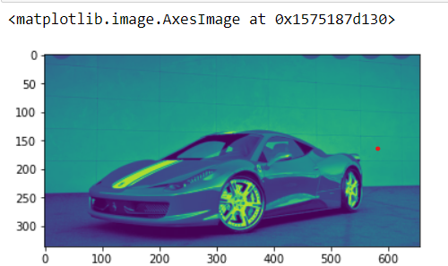
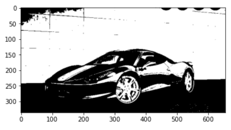
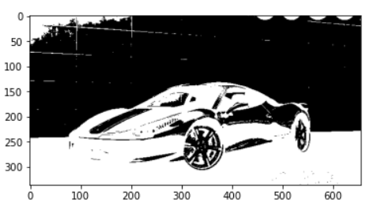
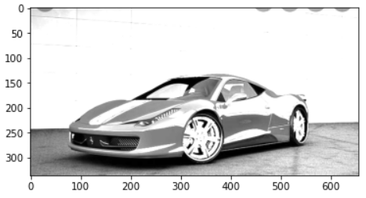
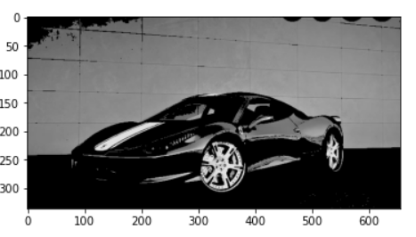
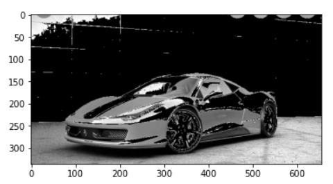
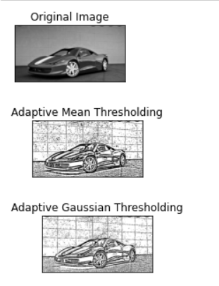
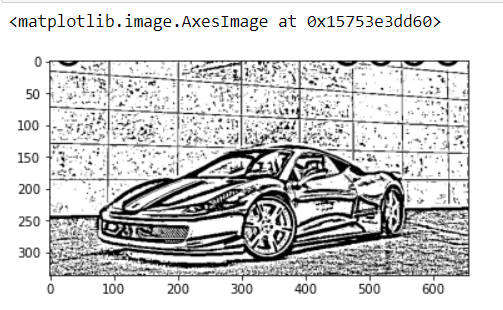

# Thresholding of Images
## Aim
To segment the image using global thresholding, adaptive thresholding and Otsu's thresholding using python and OpenCV.

## Software Required
1. Anaconda - Python 3.7
2. OpenCV

## Algorithm
### Step 1:
Load the image and convert the image to Grayscale.
### Step 2:
Smoothen the image using Gaussian Method.
### Step 3:
Apply thresholding cv2.THRESH_BINARY on the image.
### Step 4:
Apply thresholding cv2.THRESH_BINARY_INC on the image.
### Step 5:
Apply thresholding cv2.THRESH_TRUNC on the image.
### Step 6:
Apply thresholding cv2.THRESH_TOZERO on the image.
### Step 7:
Apply thresholding cv2.THRESH_TOZERO_INC on the image.

## Program
### Load the necessary packages
```
import cv2
import matplotlib.pyplot as plt
```
### Read the Image and convert to grayscale
```
BGR_image=cv2.imread('2.jpg')
gray=cv2.cvtColor(BGR_image,cv2.COLOR_BGR2GRAY)
plt.imshow(gray)
```
### Use Global thresholding to segment the image
```
ret,thresh1=cv2.threshold(gray,100,255,cv2.THRESH_BINARY )
ret,thresh2=cv2.threshold(gray,100,255,cv2.THRESH_BINARY_INV)
ret,thresh3=cv2.threshold(gray,100,255,cv2.THRESH_TRUNC)
ret,thresh4=cv2.threshold(gray,100,255,cv2.THRESH_TOZERO)
ret,thresh5=cv2.threshold(gray,100,255,cv2.THRESH_TOZERO_INV)
```
### Use Adaptive thresholding to segment the image
```
img= cv2.GaussianBlur(gray,(3,3),0)
th1 = cv2.adaptiveThreshold(gray, 255, cv2.ADAPTIVE_THRESH_MEAN_C,cv2.THRESH_BINARY, 11,2) 
th2= cv2.adaptiveThreshold(gray, 255, cv2.ADAPTIVE_THRESH_GAUSSIAN_C,cv2.THRESH_BINARY, 11,2)
titles = ['Original Image', 'Adaptive Mean Thresholding', "Adaptive Gaussian Thresholding"]
images =[img, th1, th2]
for i in range(3):
          plt.subplot (3,1,i+1),
          plt.imshow(images[i], 'gray')
          plt.title(titles[i])
          plt.xticks([]),plt.yticks([])
          plt.show()
```
### Use Otsu's method to segment the image 
```
ret2,th2 = cv2.threshold(gray,0,255,cv2.THRESH_BINARY+cv2.THRESH_OTSU)
```
# Display the results
```
plt.imshow(thresh1,cmap='gray')
plt.imshow(thresh2,cmap='gray')
plt.imshow(thresh3,cmap='gray')
plt.imshow(thresh4,cmap='gray')
plt.imshow(thresh5,cmap='gray')
plt.imshow(th2,cmap='gray')
```
## Output
### Original Image

### Global Thresholding





### Adaptive Thresholding


### Optimum Global Thesholding using Otsu's Method


## Result
Thus the images are segmented using global thresholding, adaptive thresholding and optimum global thresholding using python and OpenCV.

